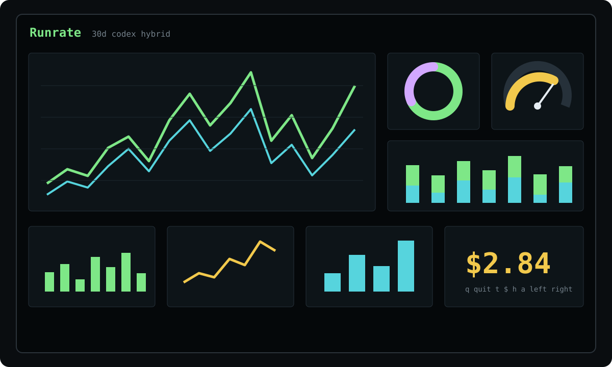

# Runrate

Realtime token, cache, and cost telemetry for AI coding agents.

```bash
npx @crup/runrate
```



## What is Runrate?

Runrate is a local-first terminal dashboard for watching AI coding usage in real time. It reads local usage artifacts, normalizes token events, maps them to estimated cost, and renders a graphics-first dashboard across time windows, sessions, models, workspaces, and providers.

Runrate does not proxy model traffic and does not require a hosted account.

## Features

- Realtime Blessed/contrib TUI launched by `runrate` or `npx @crup/runrate`
- Graphics-heavy live view with line charts, stacked bars, donut charts, gauges, sparklines, and LCD counters
- Codex adapter tested against local `~/.codex` JSONL artifacts
- Best-effort Claude Code adapter with fixture coverage
- Multi-model sessions: costs are calculated per event using that event's model, then rolled up
- Token, cost, cache, session, model, provider, and workspace summaries
- JSON export, NDJSON live stream, and static table output
- Local-first privacy and no native database dependency

## Quick Start

```bash
npx @crup/runrate
```

Or install globally:

```bash
npm install -g @crup/runrate
runrate
```

## Commands

```bash
runrate                         # live TUI
runrate watch --window 15m      # explicit live TUI
runrate table --window 24h      # static table
runrate export --format json    # JSON export
runrate export --format ndjson --live
runrate adapters list
runrate adapters doctor
runrate doctor
runrate --help
runrate --version
```

## Options

```txt
--window <window>       1m,5m,15m,30m,1h,12h,24h,7d,30d
--scope <scope>         global,account,workspace,session,billing-block
--provider <provider>   filter by adapter/provider, such as codex
--model <model>         filter by model id
--account <name>        filter by account label
--workspace <name>      filter by workspace/repo/directory label
--session <id>          filter by native provider session id
--pricing <mode>        vendor,calculated,hybrid,compare
--timezone <tz>         IANA timezone, default local
--config <path>         custom config path
--json                  output JSON where supported
--no-color              disable color
--debug                 show debug logs
```

## TUI Controls

```txt
left     smaller time window
right    larger time window
t        token chart
$        cost chart
h        cache chart
a        active sessions chart
q        quit
```

## Adapters

### Codex

Codex is the primary v0.1.0 adapter. Runrate detects:

```txt
~/.codex/sessions/**/*.jsonl
~/.codex/archived_sessions/*.jsonl
```

It normalizes `event_msg` `token_count.info.last_token_usage` records and maps:

- `input_tokens - cached_input_tokens` to fresh input
- `cached_input_tokens` to cache read
- `output_tokens - reasoning_output_tokens` to output
- `reasoning_output_tokens` to reasoning

Codex sessions can use multiple models. Runrate keeps `modelId` on every normalized usage event, calculates cost per event, then rolls up to session, workspace, provider, and global summaries.

### Claude Code

Claude Code support is best-effort in v0.1.0. The adapter detects common `~/.claude/projects/**/*.jsonl` locations and has fixture coverage, but this release has not been validated against local Claude Code data on the maintainer machine.

### Future Adapters

The adapter SDK is intentionally generic. Future adapters can support tools such as Gemini CLI, Cursor, OpenCode, OpenAI/Anthropic local tools, and other local usage artifacts by implementing detection, scanning, and normalization.

## Configuration

Config precedence:

```txt
CLI flags > project config > user config > defaults
```

Project config:

```txt
./runrate.config.json
```

User config:

```txt
macOS:   ~/Library/Application Support/runrate/config.json
Linux:   ~/.config/runrate/config.json
Windows: %APPDATA%/runrate/config.json
```

Example:

```json
{
  "timezone": "local",
  "pricingMode": "hybrid",
  "defaultWindow": "1h",
  "defaultScope": "global",
  "adapters": {
    "codex": {
      "enabled": true,
      "sources": []
    }
  }
}
```

## Pricing

Runrate supports:

```txt
vendor       provider-supplied cost when available
calculated   local pricing-table calculation
hybrid       vendor cost first, calculated fallback
compare      retain both vendor and calculated values
```

The bundled pricing table is static and intended for local estimates. Pricing can change; verify current vendor pricing before using Runrate output for billing decisions.

## Architecture

```txt
raw local artifacts
  -> adapter detection
  -> adapter scan
  -> adapter normalization
  -> normalized event store
  -> pricing engine
  -> rollup engine
  -> TUI / table / JSON / NDJSON
```

The core does not parse provider files directly. Adapters own provider-specific file formats and emit normalized usage events.

## Development

```bash
pnpm install
pnpm dev
```

Common commands:

```bash
pnpm build
pnpm typecheck
pnpm lint
pnpm format:check
pnpm test
pnpm pack:check
```

## Contributing

Runrate is early-stage OSS. Contributions are welcome, especially adapters, fixtures, terminal UI improvements, pricing corrections, and parser correctness fixes.

Adapters must include detection logic, scan logic, normalization logic, redacted fixtures, and tests. Do not commit real provider logs, secrets, API keys, prompts, or private conversation content.

Parser correctness matters more than pretty charts. If a provider emits streamed snapshots or cumulative counters, normalize those records before aggregation.

## Releases

Runrate uses semantic versioning and Changesets. Every user-facing change should include:

```bash
pnpm changeset
```

The release workflow runs build and tests on pushes to `main`. npm publishing is manually gated through `workflow_dispatch` with the `publish` input enabled. Local npm publishing is not part of the v0.1.0 workflow.

Before release:

```bash
pnpm typecheck
pnpm lint
pnpm format:check
pnpm test
pnpm build
pnpm pack:check
```

## Privacy

Runrate is local-first. It reads local usage artifacts and renders local dashboards. By default, Runrate does not upload usage data anywhere.

Provider logs may contain sensitive prompts, file paths, repo names, or session metadata. Fixtures and bug reports should use redacted data only.

## License

MIT
