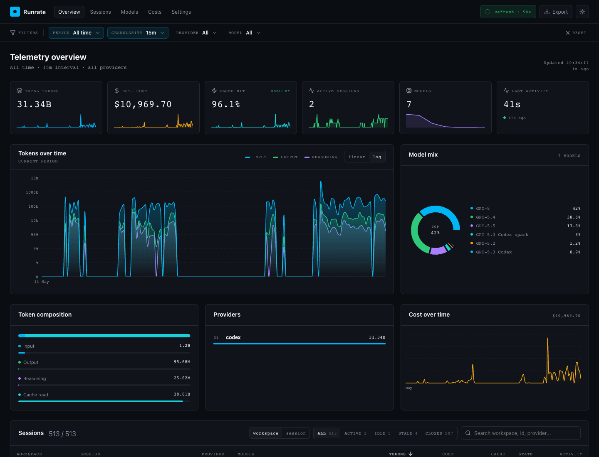
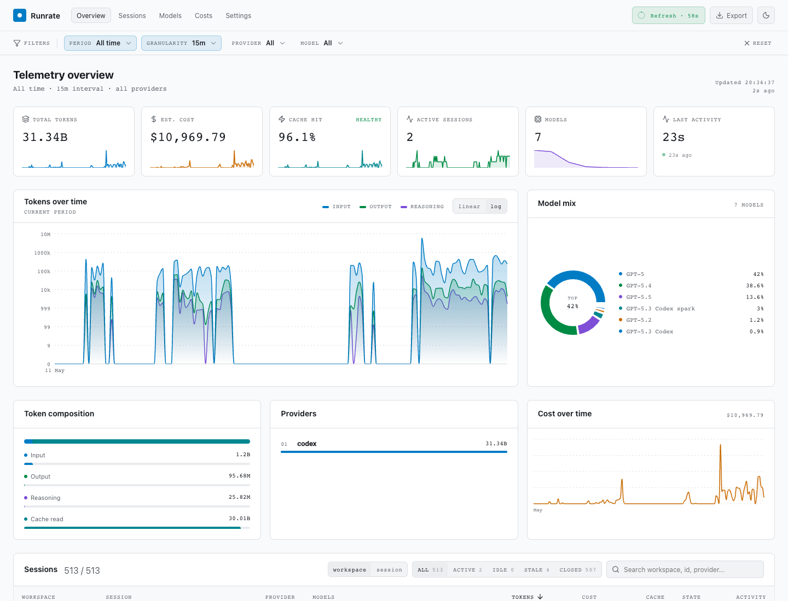

# Runrate

> Near real-time token, cache, session, model, and cost telemetry for local AI coding agents.

[](https://www.npmjs.com/package/@crup/runrate)
[](https://nodejs.org/)
[](LICENSE)
[](https://github.com/crup/runrate/actions/workflows/ci.yml)
[](https://github.com/crup/runrate/issues)
[](https://github.com/crup/runrate/pulls)
[](https://github.com/crup/runrate/issues?q=is%3Aissue%20state%3Aopen%20label%3A%22good%20first%20issue%22)
[](https://github.com/crup/runrate/graphs/contributors)
[](https://github.com/crup/runrate/commits/main)
[](#status)
[](#development)

```bash
npx @crup/runrate
```

Runrate opens a local React dashboard for the usage data your coding agents already write to disk. No hosted account. No proxy. No remote collector.



The README screenshots are from real local Codex usage with private project names masked as `******`. Public/open project names such as `runrate`, `port`, and `react-timer-hook` are left visible.

<details>
<summary>Light mode screenshot</summary>



</details>

## Why I Built It

I use Codex aggressively. On a Pro plan, the practical bottleneck is not just the monthly bill; it is the rolling usage window. A few overly broad prompts, a runaway context, or a session that keeps dragging a huge cached prefix can burn a surprising amount of the 5-hour window before you notice.

The CLI output was not enough. I wanted something closer to an instrument panel:

- How much did this session actually cost?
- Is cache helping or am I repeatedly paying fresh-input rates?
- Did one workspace or model dominate the current window?
- Are my prompt changes making usage better or worse?
- Can I catch a runaway session while it is happening?

Runrate is the dashboard I wanted beside my editor: local-first, near real time, visual, and practical enough to help tune prompts instead of guessing after the fact.

## What It Shows

- 📈 Token usage over time, with linear/log scale for large spikes
- 💵 Estimated cost by model, session, provider, and workspace
- ⚡ Cache hit ratio and cache-read volume
- 🧠 Model mix across multi-model sessions
- 🗂️ Session list grouped by workspace or full session id
- 🕒 Calendar filters: Today, Yesterday, This week, Last week, This month, Last month, All time
- 🔎 Filters for provider/model
- 🌓 Dark/light mode, persisted locally
- 🔁 Configurable refresh interval, defaulting to 1 minute
- 🧰 Local server with automatic `+1` port fallback if the preferred port is busy

## Status

Runrate is ready for early OSS testing.

| Area              | Status                                                          |
| ----------------- | --------------------------------------------------------------- |
| Codex             | ✅ Tested against real local maintainer data and fixtures       |
| Claude Code       | ⚠️ Best-effort, fixture-tested only                             |
| Pricing           | ⚠️ Local estimates using bundled rates and documented fallbacks |
| UI period compare | 🚧 Removed for now; planned for a later version                 |
| Test suite        | ✅ Vitest coverage for core pricing/parser regressions          |
| Packaging         | ✅ `npm pack --dry-run` checked                                 |

If you find a parsing bug, wrong total, missing model, or awkward UI behavior, please open an issue. Small fixtures and focused PRs are very welcome.

## Quick Start

```bash
npx @crup/runrate
```

Or install globally:

```bash
npm install -g @crup/runrate
runrate
```

The dashboard binds to `127.0.0.1` on an uncommon default port. If that port is unavailable, Runrate tries the next port upward.

```bash
runrate --port 49137
runrate --no-open
```

## Command

```bash
runrate                    # local web dashboard
runrate --port 49137       # prefer a custom local port
runrate --no-open          # print URL without opening a browser
runrate --help
runrate --version
```

## Options

```txt
--scope <scope>         global,account,workspace,session,billing-block
--provider <provider>   filter by provider/adapter, such as codex
--model <model>         filter by model id
--account <name>        filter by account label
--workspace <name>      filter by workspace/repo/directory label
--session <id>          filter by native provider session id
--pricing <mode>        vendor,calculated,hybrid,compare
--timezone <tz>         IANA timezone, default local
--config <path>         custom config path
--port <port>           preferred local HTTP port, default 43871
--host <host>           local bind host for watch, default 127.0.0.1
--no-open               do not open the browser automatically
```

## Adapter Support

### Codex

Codex is the primary adapter in this release.

Runrate detects:

```txt
~/.codex/sessions/**/*.jsonl
~/.codex/archived_sessions/*.jsonl
```

It normalizes `event_msg` `token_count` records and maps:

- `input_tokens - cached_input_tokens` to fresh input
- `cached_input_tokens` to cache read
- `output_tokens` to output
- `reasoning_output_tokens` to reasoning

Codex sessions can use multiple models. Runrate keeps `modelId` on every normalized usage event, calculates cost per event, then rolls up to session, workspace, provider, and global summaries.

If a Codex token record does not include a model, Runrate resolves the model from nearby session metadata and model context. If no model can be recovered, Runrate marks the event as inferred and falls back to `gpt-5` for pricing. This mirrors Codeburn's Codex behavior and avoids silently pricing missing-model Codex usage as `$0`.

### Claude Code

Claude Code support is best-effort in this release.

Runrate detects common `~/.claude/projects/**/*.jsonl` locations and has fixture coverage, but it has **not** been validated against real local Claude Code data on the maintainer machine. Runrate is currently tested in daily use only with Codex. Claude Code users should treat totals as provisional and report sanitized fixtures for parser corrections.

### Future Adapters

The adapter SDK is intentionally generic. Future adapters can support tools such as Gemini CLI, Cursor, OpenCode, OpenAI/Anthropic local tools, and other local usage artifacts by implementing detection, scanning, and normalization.

## Pricing

Runrate supports four pricing modes:

```txt
vendor       provider-supplied cost when available
calculated   local pricing-table calculation
hybrid       vendor cost first, calculated fallback
compare      retain both vendor and calculated values
```

The default is `hybrid`.

The bundled pricing table is static and intended for local estimates. Pricing can change; verify current vendor pricing before using Runrate output for billing decisions.

Calculated pricing uses normalized token classes:

```txt
fresh input = input_tokens - cached_input_tokens

cost =
  fresh input * input rate
  + output * output rate
  + reasoning * reasoning/output rate
  + cache read * cache-read rate
  + cache write * cache-write rate
```

Codex/OpenAI-style cached input is subtracted from fresh input before pricing. Missing Codex models are inferred as `gpt-5`, and Codex model aliases such as `gpt-5.2-low` and `gpt-5.1-codex-high` are mapped to bundled pricing entries.

## How It Works

```txt
local provider artifacts
  -> adapter detection
  -> streaming scan
  -> provider-specific normalization
  -> token/cost calculation
  -> rollups by time/session/model/provider/workspace
  -> local web dashboard
```

Runrate does not parse provider files in the dashboard layer. Adapters own provider-specific formats and emit normalized usage events.

For large Codex sessions, Runrate streams JSONL and keeps slim records for token accounting instead of holding complete logs with prompts in memory.

## Configuration

Config precedence:

```txt
CLI flags > project config > user config > defaults
```

Project config:

```txt
./runrate.config.json
```

User config:

```txt
macOS:   ~/Library/Application Support/runrate/config.json
Linux:   ~/.config/runrate/config.json
Windows: %APPDATA%/runrate/config.json
```

Example:

```json
{
  "timezone": "local",
  "pricingMode": "hybrid",
  "defaultWindow": "1h",
  "defaultScope": "global",
  "adapters": {
    "codex": {
      "enabled": true,
      "sources": []
    }
  }
}
```

## Privacy

Runrate is local-first:

- It reads local usage artifacts.
- It renders a local dashboard.
- It does not upload usage data by default.
- It does not proxy model traffic.
- It does not require a hosted account.

Provider logs may contain sensitive prompts, file paths, repo names, session ids, or workspace metadata. Do not paste raw logs into public issues. Please share small redacted fixtures instead.

The README screenshots are generated from real local Codex usage. Private project names are masked as `******`; public/open project names such as `runrate`, `port`, and `react-timer-hook` are left visible.

## Development

```bash
pnpm install
npm start
```

Common commands:

```bash
pnpm dev
pnpm build
pnpm typecheck
pnpm lint
pnpm format:check
pnpm test
pnpm pack:check
```

Current local verification:

```txt
TypeScript: passing
ESLint:     passing
Prettier:   passing
Vitest:     6 tests passing
Build:      passing
Pack check: passing
```

## Contributing

Bugs, corrections, and contributions are welcome.

Start here:

- 🧭 [Contributing guide](CONTRIBUTING.md)
- 🐛 [Report a bug](https://github.com/crup/runrate/issues/new?template=bug_report.yml)
- 💡 [Request a feature](https://github.com/crup/runrate/issues/new?template=feature_request.yml)
- 🔌 [Request an adapter](https://github.com/crup/runrate/issues/new?template=adapter_request.yml)
- 🔁 [Open pull requests](https://github.com/crup/runrate/pulls)
- 👥 [Contributors graph](https://github.com/crup/runrate/graphs/contributors)
- 🔐 [Security policy](SECURITY.md)
- 🛟 [Support guide](SUPPORT.md)
- 🤝 [Code of conduct](CODE_OF_CONDUCT.md)
- 👤 [Code owners](.github/CODEOWNERS)

Good first contributions:

- Add redacted fixtures for more provider formats
- Fix model aliases or pricing entries
- Improve session grouping and model breakdowns
- Validate Claude Code against real local data
- Add parser tests for weird cumulative-token streams
- Improve docs, screenshots, and onboarding

Adapter contributions should include:

- detection logic
- scan logic
- normalization logic
- redacted fixtures
- tests for model resolution, token accounting, cache tokens, vendor cost, and session/workspace metadata

Parser correctness matters more than pretty charts. If a provider emits streamed snapshots or cumulative counters, normalize those records before aggregation.

## Acknowledgements

Runrate learned from the shape and behavior of existing local usage tools:

- [Codeburn](https://github.com/getagentseal/codeburn) influenced Codex model resolution, token accounting parity, and the practical need to avoid silently pricing unknown models at `$0`.
- [ccusage](https://github.com/ryoppippi/ccusage) helped establish the value of simple local usage inspection for Claude Code users.

Runrate is an independent project with a different goal: a local web dashboard for near real-time operational visibility while coding.

## Releases

Runrate uses semantic versioning and Changesets. Every user-facing change should include:

```bash
pnpm changeset
```

Before release:

```bash
pnpm typecheck
pnpm lint
pnpm format:check
pnpm test
pnpm build
pnpm pack:check
```

The release workflow runs build and tests on pushes to `main`. npm publishing is manually gated through `workflow_dispatch` with the `publish` input enabled.

## License

[MIT](LICENSE)
